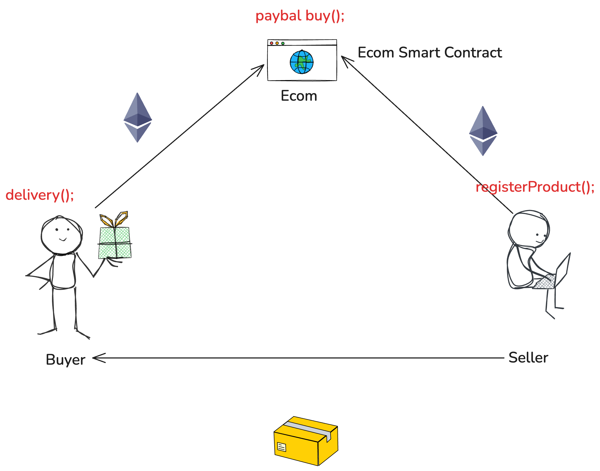

## Design The Smart Contract 


## Testing Smart Contract Details
```bash
status	0x1 Transaction mined and execution succeed
transaction hash	0x489886fbf3eacb6701e34c68c3db3612705dd091db3f14c3144f27c413f9b303
block hash	0x7dec5dd77c100cc3c751ba3c3771a1169c3fa8fbcfa13b3fce30526f111b76d3
block number	7
from	0x5c6B0f7Bf3E7ce046039Bd8FABdfD3f9F5021678
to	Ecommerce.registerProduct(string,string,uint256) 0x9A84568a5EAAEa0363527E9dBB5AeE7d8324df59
gas	194816 gas
transaction cost	169405 gas 
execution cost	147169 gas 
input	0x315...00000
output	0x
decoded input	{
	"string _title": "mobile",
	"string _desc": "Mobile 2024",
	"uint256 _price": "1222"
}
decoded output	{}
logs	[
	{
		"from": "0x9A84568a5EAAEa0363527E9dBB5AeE7d8324df59",
		"topic": "0x0354b83c7e5660789a9fbab76d1d4dce18d54215dcac7eb9156477f4d90f49c0",
		"event": "Registered",
		"args": {
			"0": "mobile",
			"1": "1",
			"2": "0x5c6B0f7Bf3E7ce046039Bd8FABdfD3f9F5021678",
			"title": "mobile",
			"productId": "1",
			"seller": "0x5c6B0f7Bf3E7ce046039Bd8FABdfD3f9F5021678"
		}
	}
]
raw logs	[
  {
    "logIndex": "0x1",
    "blockNumber": "0x7",
    "blockHash": "0x7dec5dd77c100cc3c751ba3c3771a1169c3fa8fbcfa13b3fce30526f111b76d3",
    "transactionHash": "0x489886fbf3eacb6701e34c68c3db3612705dd091db3f14c3144f27c413f9b303",
    "transactionIndex": "0x0",
    "address": "0x9A84568a5EAAEa0363527E9dBB5AeE7d8324df59",
    "data": "0x000000000000000000000000000000000000000000000000000000000000006000000000000000000000000000000000000000000000000000000000000000010000000000000000000000005c6b0f7bf3e7ce046039bd8fabdfd3f9f502167800000000000000000000000000000000000000000000000000000000000000066d6f62696c650000000000000000000000000000000000000000000000000000",
    "topics": [
      "0x0354b83c7e5660789a9fbab76d1d4dce18d54215dcac7eb9156477f4d90f49c0"
    ]
  }
]
```
## Product Detail 
- 0: string: title mobile
- 1: string: desc Mobile 2024
- 2: address: seller 0x5c6B0f7Bf3E7ce046039Bd8FABdfD3f9F5021678
- 3: uint256: productId 1
- 4: uint256: price 1222000000000000000000
- 5: address: buyer 0x0000000000000000000000000000000000000000
- 6: bool: isDelivered false

## Transaction Details and Deploy it

``` bash
status	0x1 Transaction mined and execution succeed
transaction hash	0x85c2285728c4c28addd9419ffa235fafe6113c1717e63d5ecffb4f1d68895cfa
block hash	0x3692410492a62dc22a5b583307e574d856e043350392a256b37f9789ead14d9e
block number	4
contract address	0x85F05208B6C3613f42366dE27BAFBd4df40a8ceb
from	0x5c6B0f7Bf3E7ce046039Bd8FABdfD3f9F5021678
to	Ecommerce.(constructor)
gas	1441375 gas
transaction cost	1253369 gas 
execution cost	1117437 gas 
input	0x608...a0033
output	0x608060405260043610610049575f3560e01c80631144fd721461004d5780633153a15b1461007557806361bc221a1461009d5780637acc0b20146100c7578063d96a094a14610109575b5f80fd5b348015610058575f80fd5b50610073600480360381019061006e9190610a7f565b610125565b005b348015610080575f80fd5b5061009b60048036038101906100969190610be6565b610351565b005b3480156100a8575f80fd5b506100b16105c4565b6040516100be9190610c7d565b60405180910390f35b3480156100d2575f80fd5b506100ed60048036038101906100e89190610a7f565b6105c9565b6040516101009796959493929190610d6f565b60405180910390f35b610123600480360381019061011e9190610a7f565b61076d565b005b5f8111801561013957506001805490508111155b610178576040517f08c379a000000000000000000000000000000000000000000000000000000000815260040161016f90610e34565b60405180910390fd5b5f600180836101879190610e7f565b8154811061019857610197610eb2565b5b905f5260205f20906006020190503373ffffffffffffffffffffffffffffffffffffffff16816005015f9054906101000a900473ffffffffffffffffffffffffffffffffffffffff1673ffffffffffffffffffffffffffffffffffffffff1614610237576040517f08c379a000000000000000000000000000000000000000000000000000000000815260040161022e90610f29565b60405180910390fd5b5f15158160050160149054906101000a900460ff1615151461028e576040517f08c379a000000000000000000000000000000000000000000000000000000000815260040161028590610f91565b60405180910390fd5b60018160050160146101000a81548160ff021916908315150217905550806002015f9054906101000a900473ffffffffffffffffffffffffffffffffffffffff1673ffffffffffffffffffffffffffffffffffffffff166108fc826004015490811502906040515f60405180830381858888f19350505050158015610315573d5f803e3d5ffd5b507ffcc296b8bdd64e3f1d1faadef50cb2d6550f645316330fe57cb1dd7e0612ead0826040516103459190610c7d565b60405180910390a15050565b5f8111610393576040517f08c379a000000000000000000000000000000000000000000000000000000000815260040161038a9061101f565b60405180910390fd5b61039b6109d5565b83815f0181905250828160200181905250670de0b6b3a7640000826103c0919061103d565b81608001818152505033816040019073ffffffffffffffffffffffffffffffffffffffff16908173ffffffffffffffffffffffffffffffffffffffff16815250505f548160600181815250505f8160a0019073ffffffffffffffffffffffffffffffffffffffff16908173ffffffffffffffffffffffffffffffffffffffff16815250505f8160c0019015159081151581525050600181908060018154018082558091505060019003905f5260205f2090600602015f909190919091505f820151815f0190816104909190611278565b5060208201518160010190816104a69190611278565b506040820151816002015f6101000a81548173ffffffffffffffffffffffffffffffffffffffff021916908373ffffffffffffffffffffffffffffffffffffffff160217905550606082015181600301556080820151816004015560a0820151816005015f6101000a81548173ffffffffffffffffffffffffffffffffffffffff021916908373ffffffffffffffffffffffffffffffffffffffff16021790555060c08201518160050160146101000a81548160ff02191690831515021790555050507f0354b83c7e5660789a9fbab76d1d4dce18d54215dcac7eb9156477f4d90f49c0848260600151336040516105a093929190611347565b60405180910390a15f808154809291906105b990611383565b919050555050505050565b5f5481565b600181815481106105d8575f80fd5b905f5260205f2090600602015f91509050805f0180546105f7906110ab565b80601f0160208091040260200160405190810160405280929190818152602001828054610623906110ab565b801561066e5780601f106106455761010080835404028352916020019161066e565b820191905f5260205f20905b81548152906001019060200180831161065157829003601f168201915b505050505090806001018054610683906110ab565b80601f01602080910402602001604051908101604052809291908181526020018280546106af906110ab565b80156106fa5780601f106106d1576101008083540402835291602001916106fa565b820191905f5260205f20905b8154815290600101906020018083116106dd57829003601f168201915b505050505090806002015f9054906101000a900473ffffffffffffffffffffffffffffffffffffffff1690806003015490806004015490806005015f9054906101000a900473ffffffffffffffffffffffffffffffffffffffff16908060050160149054906101000a900460ff16905087565b5f8111801561078157506001805490508111155b6107c0576040517f08c379a00000000000000000000000000000000000000000000000000000000081526004016107b790610e34565b60405180910390fd5b5f600180836107cf9190610e7f565b815481106107e0576107df610eb2565b5b905f5260205f209060060201905080600401543414610834576040517f08c379a000000000000000000000000000000000000000000000000000000000815260040161082b90611414565b60405180910390fd5b806002015f9054906101000a900473ffffffffffffffffffffffffffffffffffffffff1673ffffffffffffffffffffffffffffffffffffffff163373ffffffffffffffffffffffffffffffffffffffff16036108c5576040517f08c379a00000000000000000000000000000000000000000000000000000000081526004016108bc9061147c565b60405180910390fd5b5f73ffffffffffffffffffffffffffffffffffffffff16816005015f9054906101000a900473ffffffffffffffffffffffffffffffffffffffff1673ffffffffffffffffffffffffffffffffffffffff1614610956576040517f08c379a000000000000000000000000000000000000000000000000000000000815260040161094d906114e4565b60405180910390fd5b33816005015f6101000a81548173ffffffffffffffffffffffffffffffffffffffff021916908373ffffffffffffffffffffffffffffffffffffffff1602179055507fc54c8cc1c7525b424ec71b685c00d9355581a280488018c22005332ceb2fd40682336040516109c9929190611502565b60405180910390a15050565b6040518060e0016040528060608152602001606081526020015f73ffffffffffffffffffffffffffffffffffffffff1681526020015f81526020015f81526020015f73ffffffffffffffffffffffffffffffffffffffff1681526020015f151581525090565b5f604051905090565b5f80fd5b5f80fd5b5f819050919050565b610a5e81610a4c565b8114610a68575f80fd5b50565b5f81359050610a7981610a55565b92915050565b5f60208284031215610a9457610a93610a44565b5b5f610aa184828501610a6b565b91505092915050565b5f80fd5b5f80fd5b5f601f19601f8301169050919050565b7f4e487b71000000000000000000000000000000000000000000000000000000005f52604160045260245ffd5b610af882610ab2565b810181811067ffffffffffffffff82111715610b1757610b16610ac2565b5b80604052505050565b5f610b29610a3b565b9050610b358282610aef565b919050565b5f67ffffffffffffffff821115610b5457610b53610ac2565b5b610b5d82610ab2565b9050602081019050919050565b828183375f83830152505050565b5f610b8a610b8584610b3a565b610b20565b905082815260208101848484011115610ba657610ba5610aae565b5b610bb1848285610b6a565b509392505050565b5f82601f830112610bcd57610bcc610aaa565b5b8135610bdd848260208601610b78565b91505092915050565b5f805f60608486031215610bfd57610bfc610a44565b5b5f84013567ffffffffffffffff811115610c1a57610c19610a48565b5b610c2686828701610bb9565b935050602084013567ffffffffffffffff811115610c4757610c46610a48565b5b610c5386828701610bb9565b9250506040610c6486828701610a6b565b9150509250925092565b610c7781610a4c565b82525050565b5f602082019050610c905f830184610c6e565b92915050565b5f81519050919050565b5f82825260208201905092915050565b8281835e5f83830152505050565b5f610cc882610c96565b610cd28185610ca0565b9350610ce2818560208601610cb0565b610ceb81610ab2565b840191505092915050565b5f73ffffffffffffffffffffffffffffffffffffffff82169050919050565b5f610d1f82610cf6565b9050919050565b610d2f81610d15565b82525050565b5f610d3f82610cf6565b9050919050565b610d4f81610d35565b82525050565b5f8115159050919050565b610d6981610d55565b82525050565b5f60e0820190508181035f830152610d87818a610cbe565b90508181036020830152610d9b8189610cbe565b9050610daa6040830188610d26565b610db76060830187610c6e565b610dc46080830186610c6e565b610dd160a0830185610d46565b610dde60c0830184610d60565b98975050505050505050565b7f496e76616c69642070726f6475637420494400000000000000000000000000005f82015250565b5f610e1e601283610ca0565b9150610e2982610dea565b602082019050919050565b5f6020820190508181035f830152610e4b81610e12565b9050919050565b7f4e487b71000000000000000000000000000000000000000000000000000000005f52601160045260245ffd5b5f610e8982610a4c565b9150610e9483610a4c565b9250828203905081811115610eac57610eab610e52565b5b92915050565b7f4e487b71000000000000000000000000000000000000000000000000000000005f52603260045260245ffd5b7f4f6e6c792062757965722063616e20636f6e6669726d2064656c6976657279005f82015250565b5f610f13601f83610ca0565b9150610f1e82610edf565b602082019050919050565b5f6020820190508181035f830152610f4081610f07565b9050919050565b7f50726f6475637420616c72656164792064656c697665726564000000000000005f82015250565b5f610f7b601983610ca0565b9150610f8682610f47565b602082019050919050565b5f6020820190508181035f830152610fa881610f6f565b9050919050565b7f50726963652073686f756c642062652067726561746572207468616e207a65725f8201527f6f00000000000000000000000000000000000000000000000000000000000000602082015250565b5f611009602183610ca0565b915061101482610faf565b604082019050919050565b5f6020820190508181035f83015261103681610ffd565b9050919050565b5f61104782610a4c565b915061105283610a4c565b925082820261106081610a4c565b9150828204841483151761107757611076610e52565b5b5092915050565b7f4e487b71000000000000000000000000000000000000000000000000000000005f52602260045260245ffd5b5f60028204905060018216806110c257607f821691505b6020821081036110d5576110d461107e565b5b50919050565b5f819050815f5260205f209050919050565b5f6020601f8301049050919050565b5f82821b905092915050565b5f600883026111377fffffffffffffffffffffffffffffffffffffffffffffffffffffffffffffffff826110fc565b61114186836110fc565b95508019841693508086168417925050509392505050565b5f819050919050565b5f61117c61117761117284610a4c565b611159565b610a4c565b9050919050565b5f819050919050565b61119583611162565b6111a96111a182611183565b848454611108565b825550505050565b5f90565b6111bd6111b1565b6111c881848461118c565b505050565b5b818110156111eb576111e05f826111b5565b6001810190506111ce565b5050565b601f82111561123057611201816110db565b61120a846110ed565b81016020851015611219578190505b61122d611225856110ed565b8301826111cd565b50505b505050565b5f82821c905092915050565b5f6112505f1984600802611235565b1980831691505092915050565b5f6112688383611241565b9150826002028217905092915050565b61128182610c96565b67ffffffffffffffff81111561129a57611299610ac2565b5b6112a482546110ab565b6112af8282856111ef565b5f60209050601f8311600181146112e0575f84156112ce578287015190505b6112d8858261125d565b86555061133f565b601f1984166112ee866110db565b5f5b82811015611315578489015182556001820191506020850194506020810190506112f0565b86831015611332578489015161132e601f891682611241565b8355505b6001600288020188555050505b505050505050565b5f6060820190508181035f83015261135f8186610cbe565b905061136e6020830185610c6e565b61137b6040830184610d46565b949350505050565b5f61138d82610a4c565b91507fffffffffffffffffffffffffffffffffffffffffffffffffffffffffffffffff82036113bf576113be610e52565b5b600182019050919050565b7f506c6561736520706179207468652065786163742070726963650000000000005f82015250565b5f6113fe601a83610ca0565b9150611409826113ca565b602082019050919050565b5f6020820190508181035f83015261142b816113f2565b9050919050565b7f53656c6c65722063616e6e6f74206265207468652062757965720000000000005f82015250565b5f611466601a83610ca0565b915061147182611432565b602082019050919050565b5f6020820190508181035f8301526114938161145a565b9050919050565b7f50726f6475637420616c726561647920736f6c640000000000000000000000005f82015250565b5f6114ce601483610ca0565b91506114d98261149a565b602082019050919050565b5f6020820190508181035f8301526114fb816114c2565b9050919050565b5f6040820190506115155f830185610c6e565b6115226020830184610d46565b939250505056fea264697066735822122096fba6bac518ed945b2f5f8e92610b6f67232a65186055b74595bd6c1570944464736f6c634300081a0033
decoded input	{}
decoded output	 - 
logs	[]
raw logs	[]
```